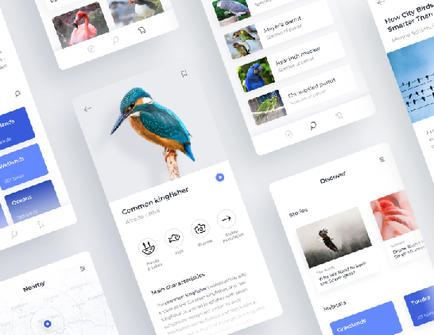
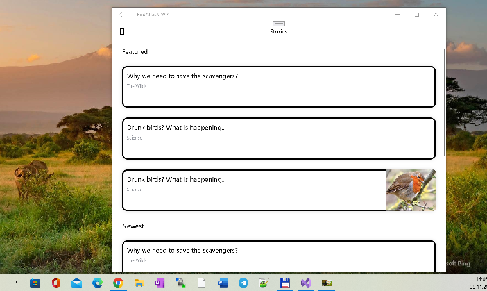

# BirdAtlas

## Design
Based upon [Dribbble project](https://dribbble.com/shots/5442850-Bird-Atlas-App) created by [Monika Michalczyk](https://dribbble.com/michalczyk):

## Screenshots

## Development
- Xamarin Forms used. The solution contains iOS, Android, and UWP projects.
- Main music track (as background task)): Geometry Dash - Geometrical dominator (lvl 19)

## Used app ("app templates")
- https://github.com/AppCreativity/BirdAtlas  (MAUI version seems to be more userful then XF...)
- https://www.birdlife.org

## Status
Work at Progress :)

## .
- me

